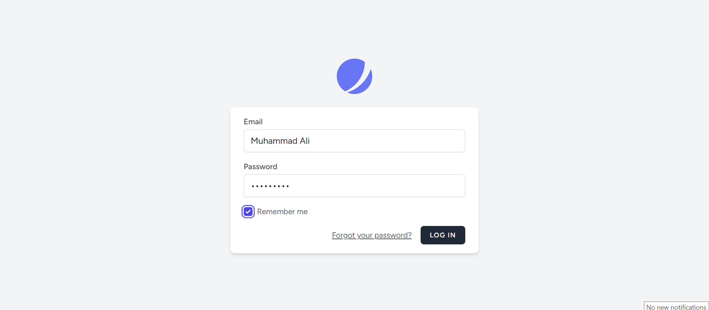

# My_Jetstream

## Table of Contents
- [Introduction](#introduction)
- [Features](#features)
- [Installation](#installation)
- [Configuration](#configuration)
- [Screenshots](#screenshots)
- [License](#license)

## Introduction
This project is a Laravel application that uses Bootstrap 5 for styling. It includes a basic navigation bar with links for login and registration. Authentication functionality is managed using Laravel Jetstream or a similar package. The project demonstrates a clean and responsive UI using Bootstrap components.

## Features
- **Responsive Navigation Bar**: A navigation bar with a collapsible menu for mobile view.

- **Conditional Authentication Links**: Login and registration links are conditionally shown based on user authentication status.

- **Search Functionality**: A search bar included in the navigation.

## Installation
Follow these steps to set up the project on your local machine:

1. **Clone the repository:**
    ```bash
    git clone https://github.com/your-username/your-bootstrap-laravel-project.git
    cd your-bootstrap-laravel-project
    ```

2. **Install dependencies:**
    ```bash
    composer install
    npm install
    ```

3. **Set up environment file:**
    ```bash
    cp .env.example .env
    php artisan key:generate
    ```
    Configure your `.env` file with database details and other required settings.

4. **Migrate the database:**
    ```bash
    php artisan migrate
    ```

5. **Install front-end assets:**
    ```bash
    npm run build
    ```

## Configuration
Update the `.env` file with your database and mail configurations:

```bash
APP_NAME=LaravelBootstrap
APP_URL=http://localhost

DB_CONNECTION=mysql
DB_HOST=127.0.0.1
DB_PORT=3306
DB_DATABASE=your_database_name
DB_USERNAME=root
DB_PASSWORD=secret

MAIL_MAILER=smtp
MAIL_HOST=smtp.mailtrap.io
MAIL_PORT=2525
MAIL_USERNAME=null
MAIL_PASSWORD=null
MAIL_ENCRYPTION=null
```

## Screenshots
Login Page


Registration Page


Navigation Bar


## License
This project is open-source and available under the MIT License.
